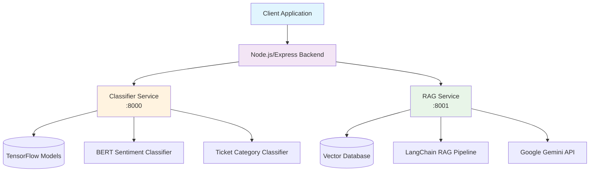

# 🚀 AI-powered CRM System

<div align="center">
  


**An intelligent, multi-model AI system designed to revolutionize customer relationship management for e-commerce platforms**

[](https://fastapi.tiangolo.com/)
[](https://tensorflow.org/)
[](https://langchain.com/)
[](https://python.org/)
[](https://opensource.org/licenses/MIT)

</div>

---

## 📋 Table of Contents

- [🎯 Overview](#-overview)
- [✨ Key Features](#-key-features)
- [🏗️ Architecture](#️-architecture)
- [🛠️ Tech Stack](#️-tech-stack)
- [🚀 Getting Started](#-getting-started)
- [📡 API Documentation](#-api-documentation)
- [🔮 Future Roadmap](#-future-roadmap)
- [🤝 Contributing](#-contributing)
- [📄 License](#-license)

---

## 🎯 Overview

The **AI-powered CRM System** is a sophisticated customer relationship management solution that leverages cutting-edge AI technologies to automate customer feedback analysis, provide intelligent support responses, and generate actionable business insights for e-commerce platforms like Amazon and Flipkart.

### 🎬 System in Action

> *A demo GIF showcasing the admin dashboard would be displayed here*


---

## ✨ Key Features

<table>
<tr>
<td width="50%">

### 🤖 **Automated Ticket Analysis**
- **Real-time Classification**: Instantly categorizes customer feedback
- **Sentiment Analysis**: Detects customer emotions with high accuracy
- **Smart Routing**: Automatically routes tickets to appropriate departments

### 🧠 **Intelligent Q&A System**
- **RAG-powered Responses**: Context-aware answers using company knowledge base
- **Natural Language Processing**: Understands complex customer queries
- **24/7 Availability**: Round-the-clock automated support

</td>
<td width="50%">

### 📈 **Strategic Business Intelligence**
- **Topic Discovery**: Uncovers hidden trends in customer feedback
- **Actionable Insights**: Transforms data into business decisions
- **Performance Analytics**: Tracks customer satisfaction metrics

### ⚡ **Enterprise-Ready Architecture**
- **Microservices Design**: Scalable and maintainable system
- **High Performance**: FastAPI-powered async processing
- **Reproducible ML Pipeline**: Complete model training infrastructure

</td>
</tr>
</table>

---

## 🏗️ Architecture

Our system follows a **microservices architecture** designed for scalability and maintainability:

<div align="center">



</div>

### 🔧 Service Breakdown

| Service | Port | Purpose | Tech Stack |
|---------|------|---------|------------|
| **Classifier Service** | 8000 | Sentiment & Category Analysis | TensorFlow 2.12, BERT, scikit-learn |
| **RAG Service** | 8001 | Q&A & Summarization | LangChain, FAISS, Google Gemini |
| **Main Backend** | 3000 | API Gateway & Database | Node.js, Express, MongoDB |

---

## 🛠️ Tech Stack

<div align="center">

### 🧠 AI & Machine Learning


### 🔧 Backend & APIs


### 🗄️ Data & Storage


</div>

---

## 🚀 Getting Started

### 📋 Prerequisites

Before you begin, ensure you have:

- 
-  for Gemini API
- 

### 🔧 Installation

#### 1️⃣ **Classifier Service Setup**

```bash
# Navigate to classifier service
cd classifier_service

# Create virtual environment
python -m venv venv_tf
# Windows
venv_tf\Scripts\activate
# macOS/Linux
source venv_tf/bin/activate

# Install dependencies
pip install -r requirements.txt

# Download pre-trained models (Option A - Recommended)
# Models will be available on Hugging Face Hub
# Or train from scratch using the provided notebooks (Option B)

# Start the service
python run.py
```

> 🟢 **Service running at**: `http://127.0.0.1:8000`

#### 2️⃣ **RAG Service Setup**

```bash
# Navigate to RAG service
cd rag_service

# Create virtual environment
python -m venv venv_rag
# Windows
venv_rag\Scripts\activate
# macOS/Linux
source venv_rag/bin/activate

# Install dependencies
pip install -r requirements.txt

# Configure environment
echo 'GOOGLE_API_KEY="your_api_key_here"' > .env

# Build knowledge base
python build_rag_index.py

# Start the service
python run.py
```

> 🟢 **Service running at**: `http://127.0.0.1:8001`

---

## 📡 API Documentation

### 🔍 Classifier Service Endpoints

<details>
<summary><strong>POST /api/analyze</strong> - Analyze customer feedback</summary>

**Request:**
```json
{
  "text": "My order arrived broken, I need a replacement immediately!"
}
```

**Response:**
```json
{
  "sentiment": {
    "label": "negative",
    "confidence": 0.92
  },
  "category": {
    "label": "product_quality",
    "confidence": 0.87
  }
}
```

</details>

### 🧠 RAG Service Endpoints

<details>
<summary><strong>POST /api/ask-rag</strong> - Get intelligent answers</summary>

**Request:**
```json
{
  "question": "What is your return policy for damaged items?"
}
```

**Response:**
```json
{
  "answer": "You can return damaged items within 30 days of purchase. We offer free return shipping and full refunds for manufacturing defects.",
  "confidence": 0.89,
  "sources": ["return_policy.pdf", "customer_handbook.pdf"]
}
```

</details>

<details>
<summary><strong>POST /api/summarize</strong> - Summarize long content</summary>

**Request:**
```json
{
  "text": "Long customer feedback text here..."
}
```

**Response:**
```json
{
  "summary": "Customer experienced shipping delay but praised product quality and customer service response.",
  "key_points": ["shipping delay", "product satisfaction", "good support"]
}
```

</details>

---

## 🔮 Future Roadmap

<div align="center">

| Phase | Features | Timeline |
|-------|----------|----------|
| **Phase 1** ✅ | Core AI Services | **Completed** |
| **Phase 2** 🚧 | Full MERN Dashboard | **Q2 2025** |
| **Phase 3** 📅 | Docker Containerization | **Q3 2025** |
| **Phase 4** 📅 | Advanced Analytics | **Q4 2025** |

</div>

### 🎯 Upcoming Features

- 📊 **Interactive Dashboard**: Complete MERN stack admin panel
- 🐳 **Containerization**: Docker support for easy deployment
- 📈 **Advanced Analytics**: Real-time performance metrics
- 🔗 **Third-party Integrations**: Shopify, WooCommerce support
- 🌐 **Multi-language Support**: Global customer base coverage

---

## 🤝 Contributing

We welcome contributions! Please see our [Contributing Guide](CONTRIBUTING.md) for details.

<div align="center">

[](https://github.com/yourusername/ai-crm-system/graphs/contributors)
[](https://github.com/yourusername/ai-crm-system/issues)
[](https://github.com/yourusername/ai-crm-system/pulls)

</div>

---

## 📄 License

This project is licensed under the MIT License - see the [LICENSE](LICENSE) file for details.

---

<div align="center">

**⭐ If this project helped you, please consider giving it a star! ⭐**

[](https://github.com/yourusername/ai-crm-system/stargazers)
[](https://github.com/yourusername/ai-crm-system/network/members)

**Made with ❤️ for the e-commerce community**

</div>
