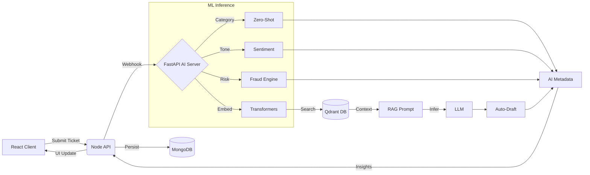

<div align="center">
  
  <h1>Sentia.ai | Enterprise Artificial Intelligence (AI) Customer Relationship Management (CRM)</h1>
  <p><strong>Intelligent Customer Experience & Fraud Detection for High-Volume E-Commerce</strong></p>
</div>

<br/>

Sentia.ai is an enterprise-grade, fullstack Customer Relationship Management (CRM) microservice platform. Designed for the scale of modern e-commerce (targeting architectures similar to Flipkart, Amazon, and Oracle), Sentia leverages **Large Language Models (LLMs)**, **Retrieval-Augmented Generation (RAG)**, and **Predictive Analytics** to automate support workflows, detect fraud, and eliminate support latency.

## 📈 The Business Impact & Statistics

At massive transaction volumes, traditional human-in-the-loop support becomes an insurmountable bottleneck. Sentia.ai is engineered to aggressively optimize operational metrics based on industry-leading AI benchmarks:

* **Drastic Cost Reduction:** Traditional human-handled support tickets cost on average **$6.00 to $25.00** per resolution. Sentia's Agentic Auto-Draft aims to reduce the cost of routine inquiries to **$0.05 - $0.50**, resulting in up to a **70% reduction in support OPEX**.
* **Microsecond Resolution Targets:** While human queues have an average response latency of 5 to 30+ minutes, Sentia's LLM pipeline drafts contextually aware, RAG-backed responses in **< 2 seconds**, dramatically cutting Mean Time to Resolution (MTTR).
* **Predictive Risk Mitigation:** By proactively analyzing ticket metadata for fraud risk before the agent ever opens the ticket, Sentia prevents costly policy abuse and return fraud dynamically.

---

## 🧠 How Sentia Uses AI

Sentia isn't just a wrapper around an API; it runs a dedicated Deep Learning microservice to execute four core AI pipelines simultaneously whenever a ticket is submitted:

1. **Intelligent Categorization (Zero-Shot Classification):** The ML engine instantly reads the ticket description and categorizes it (e.g., *Shipping, Refund, Technical, Product Inquiry*). This eliminates manual triaging and ensures the ticket reaches the right department instantly.
2. **Sentiment Analysis:** Using NLP models, Sentia detects the emotional tone of the customer (e.g., *Angry, Frustrated, Positive, Neutral*). "Angry" or "Frustrated" tickets are visually flagged and bumped to the top of the queue for immediate VIP handling to prevent churn.
3. **Predictive Fraud Risk Scoring:** By cross-referencing ticket metadata against known anomaly patterns, the AI assigns a Fraud Risk probability (0-100%). High-risk tickets (e.g., serial refund abusers) are flagged with visual progress bars to warn agents before they process a payout.
4. **Agentic Auto-Draft (RAG):** Using Retrieval-Augmented Generation (RAG) and Qdrant Vector Search, Sentia searches a database of past successful resolutions and company policies. It then passes this context to an LLM to generate a complete, highly empathetic, and accurate draft response. Agents simply click "Approve & Send".

### 🔄 AI Pipeline Architecture (Data Flow)


```mermaid
graph LR
    A[React Client] -->|Submit Ticket| B(Node API)
    B -->|Persist| C[(MongoDB)]
    B -->|Webhook| D{FastAPI AI Server}
    
    subgraph ML Inference
    D -->|Category| E[Zero-Shot]
    D -->|Tone| F[Sentiment]
    D -->|Risk| G[Fraud Engine]
    D -->|Embed| H[Transformers]
    end
    
    H -->|Search| I[(Qdrant DB)]
    I -->|Context| J[RAG Prompt]
    J -->|Infer| K[LLM]
    K --> L[Auto-Draft]
    
    E --> M[AI Metadata]
    F --> M
    G --> M
    L --> M
    
    M -->|Insights| B
    B -->|UI Update| A
```

---

## 🏗 Enterprise Architecture & Deployment

Sentia.ai is structured as a decoupled, horizontally scalable **3-tier microservice architecture**, designed for zero-downtime CI/CD deployments.

### 1. AI Inference Microservice (`server/`)
* **Core:** Python, FastAPI, Hugging Face, SentenceTransformers, Qdrant (Vector DB).
* **Role & Compute Isolation:** Machine learning inference (especially Transformer models) is exceptionally CPU/GPU intensive and synchronous by nature. By isolating this into a dedicated FastAPI microservice, we ensure that heavy LLM computations never block the Node.js event loop handling standard API traffic.
* **Model Pipeline Details:**
  * **Zero-Shot Classification & Sentiment:** Utilizes Hugging Face transformers (e.g., `facebook/bart-large-mnli`) to dynamically categorize text without hardcoded rules.
  * **Vector Embeddings (RAG):** Uses `SentenceTransformers` to convert customer descriptions and knowledge-base articles into high-dimensional vectors, stored and queried in **Qdrant** for lightning-fast semantic search.
* **Production Deployment:** 🚀 **Hugging Face Spaces (Dockerized)**
  * Deployed on dedicated GPU/CPU hardware through Hugging Face via a Docker container. This ensures optimized inference speeds and bypasses the severe cold-start latency and package size limits typical of AWS Lambda or Vercel when deploying heavy Python ML dependencies.

### 2. Core API Gateway & Business Logic (`express_server/`)
* **Core:** Node.js, Express, MongoDB, JWT.
* **Role:** The secure central nervous system. Handles stateless JWT authentication, Role-Based Access Control (RBAC), database persistence, and asynchronous orchestration of the Python ML microservice.
* **Production Deployment:** 🚀 **Vercel (Serverless Functions)**
  * Deployed as globally distributed Edge/Serverless functions on Vercel for infinite horizontal scaling and ultra-low latency data retrieval.

### 3. Client Interface (`client/`)
* **Core:** React, TypeScript, Vite, Framer Motion, Material UI.
* **Role:** A premium Single Page Application (SPA) offering a stunning dark-mode Admin Dashboard and a sleek Customer Portal.
* **Production Deployment:** 🚀 **Vercel (Static Global CDN)**
  * The Vite build is deployed to Vercel's global Edge Network, ensuring instant Time-To-Interactive (TTI) for customers worldwide.

---

## 💻 Tech Stack Matrix

| Layer | Technologies Used | Production Environment |
| :--- | :--- | :--- |
| **Frontend UI** | React, TypeScript, Vite, Custom CSS, Material UI | Vercel Global Edge CDN |
| **Backend API** | Node.js, Express, MongoDB | Vercel Serverless Functions |
| **AI / DL Server** | Python, FastAPI, Hugging Face, Qdrant | Hugging Face Spaces (GPU/CPU) |
| **Security** | JWT, Bcrypt, RBAC | Environment Variables / Secrets |

---

## 🚀 Local Development Setup

To run the complete platform locally, boot up all three microservices:

### 1. Python DL Microservice
```bash
cd server
python -m venv .venv
source .venv/bin/activate  # On Windows: .\.venv\Scripts\activate
pip install -r requirements.txt
uvicorn main:app --reload --port 8000
```
*(Requires `.env` with `HF_TOKEN`, `QDRANT_URL`, and `QDRANT_API_KEY`)*

### 2. Node.js Core Backend
```bash
cd express_server
npm install
npm run dev
```
*(Requires `.env` with `MONGO_URI`, `JWT_SECRET`, and `PYTHON_API_URL=http://localhost:8000`)*

### 3. React Frontend
```bash
cd client
npm install
npm run dev
```
*(Runs on `http://localhost:5173`. Connects automatically to the Node backend.)*

---

<div align="center">
  <i>Built with a rigorous focus on clean code, decoupled scalability, and solving real-world enterprise bottlenecks.</i>
</div>
